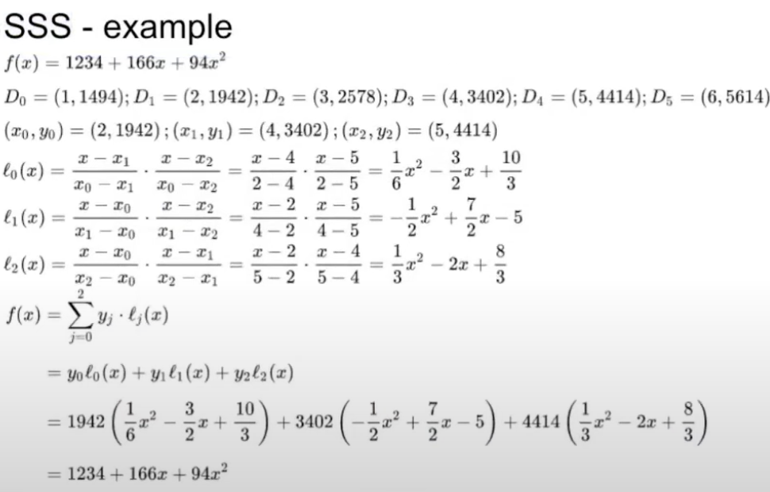

# 🔐 MPC Wallet Overview

---

**Language**: [English](./README.md) | [中文](./README_zh.md)  

---

In traditional public-key cryptography, the signer generates signatures using a private key, but relying on a single private key location introduces security risks. **MPC signatures** leverage **Secure Multi-Party Computation (MPC)** to create signatures through distributed computation, ensuring that the complete private key never exists in one location. Each participant holds a "shard" (or key share) of the private key, and a threshold number of these shares can collaboratively generate a signature.

---

### 🌟 MPC (Threshold Signature Scheme, TSS) vs. Multi-Signature

MPC signatures, known as **Threshold Signature Scheme (TSS)**, differ from traditional Multi-Signature schemes by offering these advantages:

1. **Dealerless** - No need for a private key distributor. The **complete private key never appears** during the generation process.
2. **Threshold Signing** - Each signature requires *M* participants (where M ≤ N) to successfully sign.
3. **Aggregate Signature** - Produces a single, complete signature, **minimizing on-chain transaction costs**.
4. **Private Key Recovery** - *M* participants (M ≤ N) can collaboratively recover the private key shards if needed.

---

## 📐 Shamir's Secret Sharing (SSS) Algorithm

There are various TSS protocols, most of which use the **Shamir's Secret Sharing (SSS)** algorithm. SSS is designed to distribute private information ("secret") in a way that prevents a single holder from reconstructing the secret alone. However, a sufficient number of holders can collectively rebuild the secret. 

### 🔑 How SSS Works
SSS is based on the **Lagrange Interpolation Theorem**, allowing a unique polynomial **P(x)** to be constructed using *K* points. This polynomial can be reconstructed using a minimum number of shares, keeping it secure even if attackers have unlimited time and computing power.

---

### 📊 Example

Given data points (1, 2), (2, 3), and (3, 5), a quadratic polynomial **P(x)** can be constructed such that:
- P(1) = 2, P(2) = 3, and P(3) = 5.  
- The constant term (a0) of the polynomial is the secret.

Illustrated here:

For instance, a quadratic polynomial can distribute private key shares to six administrators, with a minimum of three shares required to complete a signature.

### ⚠️ Issue and Solution
1. If one of the fragments is malicious, it’s difficult to identify which share is providing the incorrect signature.

### Solution - **Feldman Verifiable Secret Sharing (VSS)**
**Feldman VSS** offers a solution by identifying malicious actors:
1. **Verifiable Secret Sharing (VSS)** - Detects and identifies malicious actors.
2. Adds a modulo calculation to SSS: **P(x) = a0 + a1x + a2x^2 + ... + anx^n mod q**.

---

## 🔄 MPC / Threshold Signature Process

### Private Key / Address Generation Flow
1.	Send address creation request (User → Services).
2.	Send Keygen request (Services → MPC Network).
3.	Nodes generate key fragments (MPC Network).
4.	Generate aggregated public key (MPC Network → Services).
5.	Generate address (Services).
6.	Return address (Services → User).

### Signature Process
1.	User initiates a withdrawal request (User → Services).
2.	Construct transaction (Services).
3.	Signature command includes transaction msg (Services → MPC Network).
4.	Signature operations by each node in the MPC Network (MPC Network).
5.	Return signed signature (MPC Network → Services).
6.	Verify signature with aggregated public key (Services).
7.	Obtain RSV.
8.	Construct the complete transaction (Services).
9.	Send to blockchain network (Services → Blockchain Network).
10.	Transaction is completed.

---

## 🧩 TSS Variants

1. **GG18** (2018) - by Rosario Gennaro & Steven Goldfeder  
   - Has a centralized dealer responsible for coordination.
   - Cannot identify malicious actors.
   - [BNB Chain's GG18 Implementation](https://github.com/bnb-chain/tss-lib)

2. **GG20** (2020) - also by Rosario Gennaro & Steven Goldfeder  
   - Dealerless; participants act as their own coordinators.
   - Fewer interaction rounds.
   - Identifies malicious participants.
   - [ZenGo's GG20 Implementation (Rust)](https://github.com/ZenGo-X/multi-party-ecdsa)

3. **DMZ21**  
   - Reduces interaction rounds.
   - Increases efficiency.

---

## 📚 References

### Open-source Implementations
- **ZenGo** - [GG20 in Rust](https://github.com/ZenGo-X/multi-party-ecdsa)
- **QuquZone** - [TSS Library in Rust](https://github.com/ququzone/tss-lib)
- **LatticeX** - [DMZ Implementation in Rust](https://github.com/LatticeX-Foundation/opentss)
- **BNB Chain** - [GG18 in Go](https://github.com/bnb-chain/tss-lib)
- **Thorchain** - [GG20 in Go](https://gitlab.com/thorchain/thornode/-/tree/develop/bifrost/tss/go-tss)

### Additional Resources
1. [Dapp Learning Open University](https://www.youtube.com/watch?v=Da9dhEK3vg0)
2. [0xweb3 - MPC Wallet Theory](https://github.com/0xweb-3/web3_share/tree/main/wallet-doc/04.MPC%E6%89%98%E7%AE%A1%E9%92%B1%E5%8C%85%E5%8E%9F%E7%90%86)
3. [GG20 Paper](https://eprint.iacr.org/2020/540.pdf)
